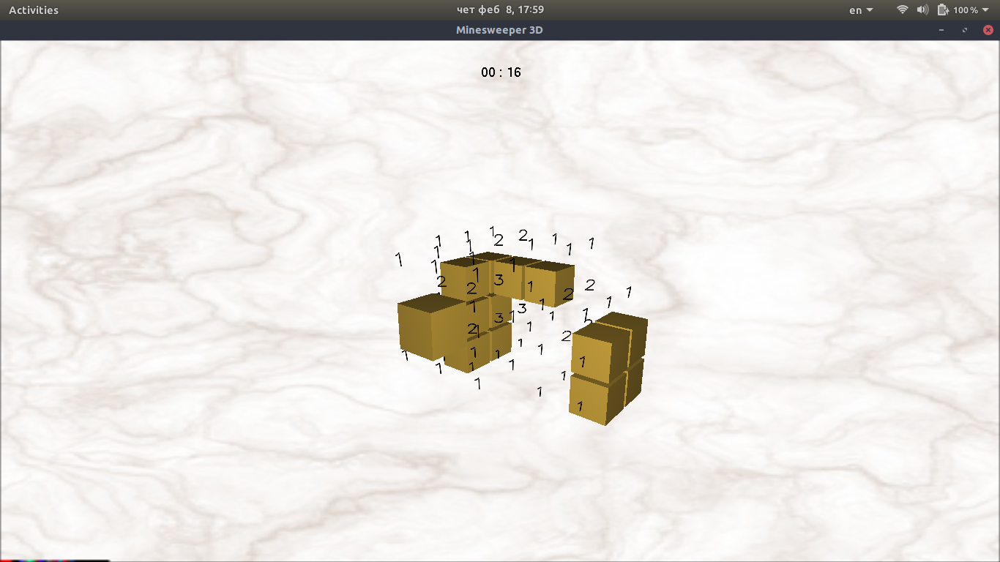

# RS018-minesweeper-3d


This is a version of minesweeper game in 3D.


## Usage

<table>
  <tr>
    <th colspan="2">Global</th>
  </tr>
  <tr>
    <td>Exit</td><td>Esc</td>
  </tr>
  <tr>
    <th colspan="2">Camera rotation</th>
  </tr>
  <tr>
    <td>Left</td><td>a</td>
  </tr>
  <tr>
    <td>Right</td><td>d</td>
  </tr>
  <tr>
    <td>Up</td><td>w</td>
  </tr>
  <tr>
    <td>Down</td><td>s</td>
  </tr>
  <tr>
    <th colspan="2">Mouse</th>
  </tr>
  <tr>
    <td>Open field</td><td>left click</td>
  </tr>
  <tr>
    <td>Put a flag on field</td><td>right click</td>
  </tr>
</table>


## Setup

1. Compile

    ```sh
	make

    ```

2. Start

    ```sh
	./minesweeper

    ```

***
## Meta

Lazar Bojanic – [@Linkedin](https://www.linkedin.com/in/lbojanic/) – lazar.bojanic@hotmail.rs

[https://github.com/LBojanic](https://github.com/LBojanic)
